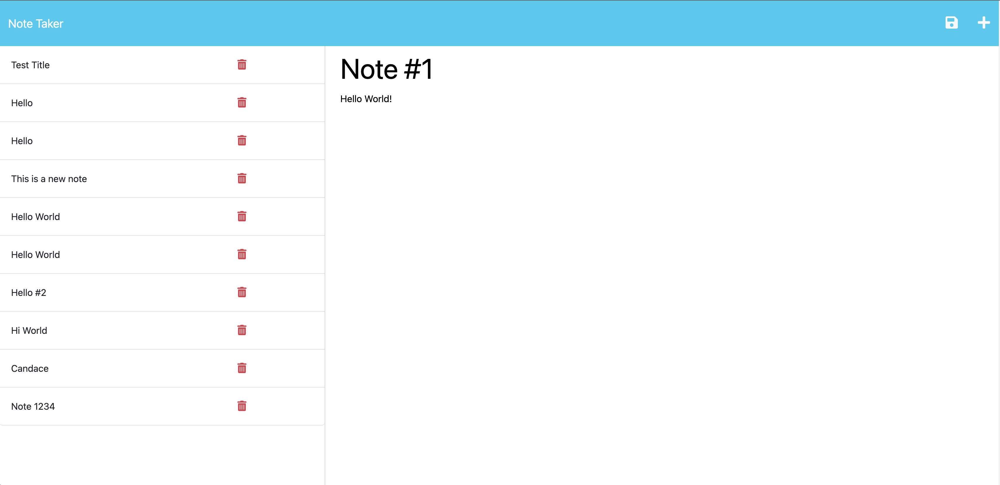
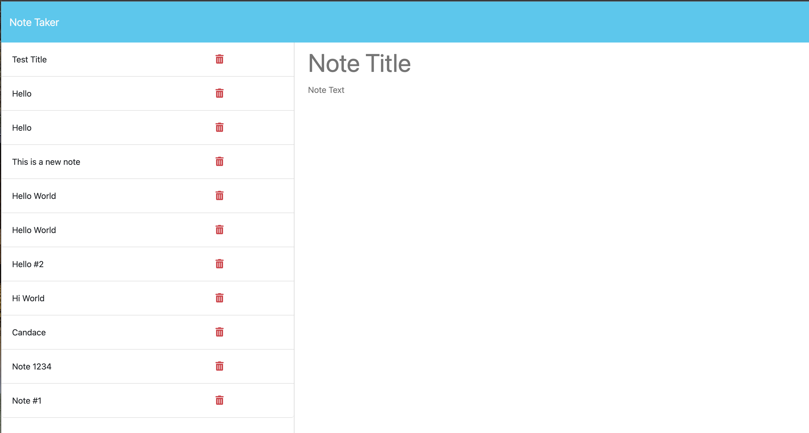

# Challenge 11 - NoteTaker

## Decription: 

* As a developer, I wanted to create the backend part of a front-end web application, allowing the user to create and log various notes.

## Acceptance Criteria:

```
GIVEN a note-taking application
WHEN I open the Note Taker
THEN I am presented with a landing page with a link to a notes page
WHEN I click on the link to the notes page
THEN I am presented with a page with existing notes listed in the left-hand column, plus empty fields to enter a new note title and the note’s text in the right-hand column
WHEN I enter a new note title and the note’s text
THEN a Save icon appears in the navigation at the top of the page
WHEN I click on the Save icon
THEN the new note I have entered is saved and appears in the left-hand column with the other existing notes
WHEN I click on an existing note in the list in the left-hand column
THEN that note appears in the right-hand column
WHEN I click on the Write icon in the navigation at the top of the page
THEN I am presented with empty fields to enter a new note title and the note’s text in the right-hand column
```

## Usage:

* This web application can be used to create and store notes for tasks the user needs to complete.

* Link to Heroku: https://dashboard.heroku.com/apps/note-taker5229
* Link to deployed site: https://note-taker5229-ecfbfdcd4843.herokuapp.com/
* Link to GitHub Repo: https://github.com/CandaceG00/NoteTaker

* Screenshots:
    
    


## Credits:

N/A